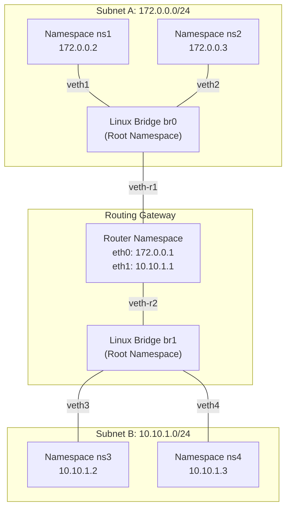

# 🌐 Software-Defined Mobile & Container Networking (SDMN)

[](https://www.kernel.org/)
[](https://www.docker.com/)
[](https://www.gnu.org/software/bash/)
[](https://www.python.org/)
[](https://opensource.org/licenses/MIT)

> **Author**: Muhammaderfan Bagherinejad ([GitHub](https://github.com/merfan-bagheri) • [LinkedIn](https://www.linkedin.com/in/merfan-bagheri))

---

## 📖 Overview

This repository explores low-level **Linux Kernel Networking, Network Virtualization, Software-Defined Routing, and Container Networking**. It implements practical architectures for isolated network namespaces (`netns`), virtual ethernet (`veth`) interconnects, Linux software bridging (`brctl`/`ip link`), inter-subnet routing gateways, and Dockerized microservices.



---

## 📂 Repository Structure

```
SDMN/
└── HW2/
    ├── q1/                     # Linux Network Namespaces & Inter-subnet Routing
    │   ├── Images/             # Architecture and topology diagrams
    │   │   ├── pic_1.png
    │   │   ├── pic_2.png
    │   │   └── pic_3.png
    │   ├── create_topology.sh  # Automated namespace, bridge, and routing setup
    │   ├── delete_topology.sh  # Clean teardown script
    │   ├── ping.sh             # Namespace-aware connectivity test script
    │   └── README.md           # Detailed theoretical & practical explanations
    ├── q2/                     # Open vSwitch / SDN Controller CLI Interface
    │   ├── cli.sh              # Command-line interface tool
    │   └── README.md           # CLI documentation and command specifications
    └── q3/                     # Containerized Microservice & HTTP Server
        ├── Dockerfile          # Container build definition
        ├── HTTPServer.py       # Python HTTP server handling network requests
        └── README.md           # Container setup, build, and execution guide
```

---

## 🚀 Key Modules & Capabilities

### 1. 🔌 Linux Network Namespaces & Virtual Routing ([`HW2/q1`](HW2/q1/))
- **Automated Topology Generation**: Shell script initializing multi-subnet environments across isolated namespaces (`ns1`-`ns4` + `router`).
- **Bridge & Gateway Configuration**: Emulates hardware switches and Layer-3 routers using virtual ethernet pairs (`veth`) and kernel IP forwarding (`sysctl -w net.ipv4.ip_forward=1`).
- **Dynamic Ping Utility**: Test end-to-end connectivity across subnets via designated gateways.

### 2. 💻 SDN / Switch Management CLI ([`HW2/q2`](HW2/q2/))
- Interactive CLI utility enabling dynamic query and manipulation of network flow tables, ports, and interface states.

### 3. 🐳 Dockerized Network Services ([`HW2/q3`](HW2/q3/))
- Lightweight Python HTTP server deployed inside isolated Docker containers to simulate microservice endpoints and analyze container-to-container latency and packet flow.

---

## 🛠️ Quickstart Guide

### Prerequisites
- Linux OS (Ubuntu 20.04 / 22.04 LTS recommended)
- `iproute2`, `bridge-utils`, `iptables`, `docker`

### Setup Network Topology
```bash
cd HW2/q1
chmod +x create_topology.sh delete_topology.sh ping.sh

# Build virtual network topology
sudo ./create_topology.sh

# Test ping between isolated namespaces
sudo ./ping.sh ns1 ns3

# Teardown topology
sudo ./delete_topology.sh
```

### Run Dockerized Service
```bash
cd HW2/q3
docker build -t sdmn-http-server .
docker run -d -p 8080:8080 --name sdmn-service sdmn-http-server
curl http://localhost:8080
```

---

## 📜 License
Distributed under the [MIT License](LICENSE).
